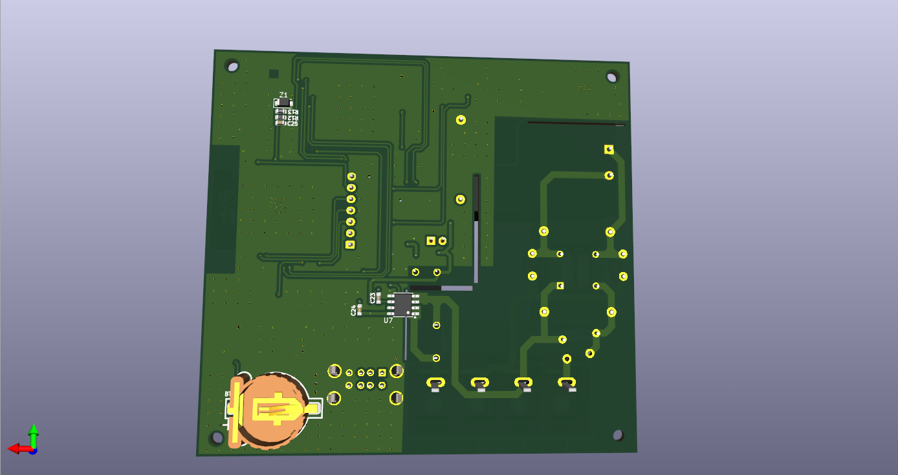

# IOT-Board-use-ESP32
An ESP32-WROOM-32E WiFi MCU-based board, featuring a USB-style pin header for SHT3x temperature and humidity sensor integration, and a dedicated interface for DWIN HMI displays. Design in Kicad.

# Key Features
- ESP32-WROOM-32E MCU.
- Module Hi-Link HLK-5M05 to convert 220VAC - 5VDC.
- On-board relay for AC load control.
- Header for SHT3x sensor.
- Module Ra-02 LoRa and header for HMI display.
- USB connector for power and programming.
# Applications
This board can be used for:
- Smart Home Controller.
- Smart Switch.
- IoT Environmental Monitoring.
- Remote Device Control.
- Industrial IoT Node.
# Development Tools
Recommended tools:
- KiCad (PCB Design).
- VSCode with IDF Enviroment.
- Arduino Framework.
