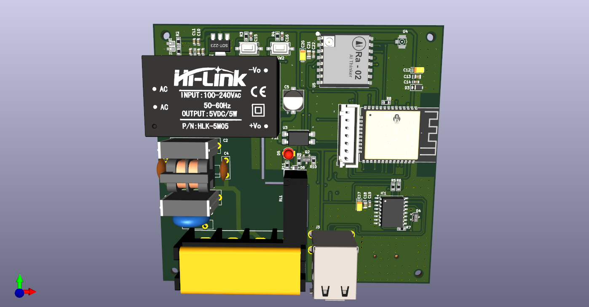

# IOT-Board-use-ESP32
An ESP32-WROOM-32E WiFi MCU-based board, featuring a USB-style pin header for SHT3x temperature and humidity sensor integration, and a dedicated interface for DWIN HMI displays.

